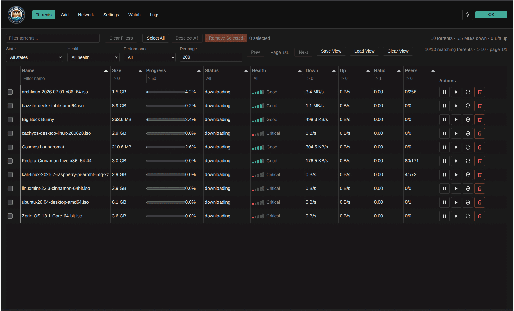

<p align="center">
  
</p>

<h1 align="center">SwarmOtter</h1>

<p align="center">
  <a href="https://github.com/sphildreth/swarmotter/actions/workflows/ci.yml">
    
  </a>
  <a href="LICENSE">
    
  </a>
  <a href="Cargo.toml">
    
  </a>
  <a href="design/vpn-network-containment.md">
    
  </a>
</p>

<p align="center">
  <em>A fast, secure Rust BitTorrent daemon with strict network containment and a practical web UI.</em>
</p>

<p align="center">
  <a href="assets/screenshots/v1.2.0/output.gif" title="Click for Screenshots">
    
  </a>
</p>

---

## What SwarmOtter Is

SwarmOtter is a performance-first Rust BitTorrent daemon built for Linux/server and homelab deployments. It features:

- **API-first** — the daemon and its API are the primary product surfaces
- **Web UI included** — practical, function-over-form, consuming the same API exposed to external automation
- **Performance-focused** — efficient async networking, disk I/O, and bounded memory usage
- **Operationally correct** — predictable behavior, safe recovery, and clear diagnostics
- **Containment-native** — VPN/NIC fail-closed traffic containment is a core requirement

## What SwarmOtter Is Not

SwarmOtter is not a torrent indexer, search engine, or piracy assistant. It's designed for lawful content distribution and does not include:
- Bundled torrent indexes
- Infringing magnet links
- Copyrighted media examples

## Features

SwarmOtter provides a comprehensive set of BitTorrent features:

- **Performance-focused daemon** with live BitTorrent data plane
- **Native REST API** with WebSocket and Server-Sent Events
- **Optional compatibility** with Transmission and qBittorrent automation tools
- **Practical Web UI** that uses the same API as external automation
- **Advanced torrent handling** including magnet links, .torrent files, metadata-first previews
- **BEP 52 v2/hybrid support** with full SHA-1/SHA-256 identities
- **Protocol support** for TCP and uTP peer wire protocols
- **Encryption** with MSE/PE support in configurable modes
- **Containment features** including SOCKS5 proxy support and strict network boundaries
- **DHT, PEX, HTTP/HTTPS trackers**, UDP trackers, and webseeds
- **Fast resume** and forced recheck capabilities
- **Versioned SQLite storage** with migration from legacy JSON state
- **Watch-folder import** functionality
- **Advanced controls** for file selection, queueing, bandwidth, ratio, and seeding
- **Policy profiles** with deterministic label selection
- **Disk-aware storage** with filesystem diagnostics and placement
- **Container-friendly deployment** options

## Network Containment

SwarmOtter enforces strict network containment as a core requirement. All torrent-related traffic is constrained through configured network paths including:

- Peer TCP and UDP / uTP
- DHT UDP
- PEX-discovered peers
- UDP trackers
- HTTP / HTTPS trackers
- Webseeds
- Magnet metadata fetching
- DNS used by torrent operations

The daemon **fails closed** and never silently falls back to the default route if configured path is unavailable. The Web UI/API control plane operates separately from the torrent data plane.

Containment is strict by default - omitting `[network]` requires a valid path for configuration validation. For development scenarios, disabled mode can be explicitly set. Live path loss blocks all traffic until explicit configuration replacement proves connectivity.

See [`docs/network-containment.md`](docs/network-containment.md) for detailed information.

## Lawful Use

SwarmOtter is designed for lawful downloading, sharing, and seeding of content that users have the right to access and distribute. It supports:

- Linux distributions
- Open-source project releases
- Public-domain media
- Open datasets
- User-owned files
- Organization-approved distribution workflows

Users are responsible for ensuring their use complies with applicable laws and the rights of content owners. This is project policy and documentation, not legal advice.

For more information on lawful use, see:
- [`docs/lawful-use.md`](docs/lawful-use.md)
- [`docs/legal.md`](docs/legal.md)

## Getting Started

### Prerequisites

- Rust 1.88 or newer (see `rust-version` in `Cargo.toml`)
- Cargo
- Git
- Linux is recommended for network-containment development and testing

### Installation

```bash
git clone https://github.com/sphildreth/swarmotter.git
cd swarmotter
cargo build --release
```

### First-Time Setup

```bash
cargo fmt
cargo check
cargo test
```

### Workspace Layout

SwarmOtter is a Cargo workspace with four crates:

| Crate | Role |
| --- | --- |
| `crates/swarmotterd` | Daemon binary |
| `crates/swarmotter-core` | Core types and live torrent engine logic |
| `crates/swarmotter-api` | API layer |
| `crates/swarmotter-web` | Web UI / static asset support |

## Repository Structure

```text
swarmotter/
├── AGENTS.md                  # Coding-agent governance rules
├── README.md
├── LICENSE                    # Apache-2.0
├── CONTRIBUTING.md
├── SECURITY.md
├── CODE_OF_CONDUCT.md
├── THIRD_PARTY_LICENSES.md
├── CHANGELOG.md
├── Cargo.toml                 # Workspace root
├── crates/
│   ├── swarmotterd/           # Daemon binary
│   ├── swarmotter-core/       # Core types and engine logic
│   ├── swarmotter-api/        # API layer
│   └── swarmotter-web/        # Embedded/static web support
├── docs/                      # User guide and operator documentation
├── design/                    # Requirements, architecture, policy, ADRs
│   ├── requirements.md
│   ├── architecture.md
│   ├── api.md
│   ├── configuration.md
│   ├── vpn-network-containment.md
│   ├── deployment.md
│   ├── testing.md
│   ├── lawful-use.md
│   ├── content-policy.md
│   ├── legal.md
│   └── adr/                   # Architecture decision records
├── assets/                    # Logo and brand graphics
└── .github/                   # Issue and PR templates
```

## Architecture Decision Records

Important technical, legal, operational, and dependency decisions are recorded
as Architecture Decision Records (ADRs) in
[`design/adr/`](design/adr/).

New architecture, legal, dependency, or network-containment decisions require
ADRs. When in doubt, create one. See
[`design/adr/README.md`](design/adr/README.md) for the format and lifecycle.

## Homelab Deployment

A typical homelab deployment:

1. Run a VPN container or VPN-enabled network namespace
2. Run `swarmotterd` inside that network path
3. Mount persistent config and download directories
4. Expose only the Web UI/API port to the LAN
5. Keep torrent peer / tracker / DHT traffic constrained to the VPN path

See [`docs/deployment.md`](docs/deployment.md) for detailed deployment instructions.

## Documentation

Published user guide:
- <https://sphildreth.github.io/swarmotter/>

User-facing documentation:
- [User guide](docs/index.md)
- [Configuration](docs/configuration.md)
- [API reference](docs/api.md)
- [Network containment](docs/network-containment.md)
- [Deployment](docs/deployment.md)
- [Troubleshooting](docs/troubleshooting.md)
- [Lawful use](docs/lawful-use.md)
- [Legal and content policy](docs/legal.md)

Project design documentation:
- [Requirements](design/requirements.md)
- [Architecture](design/architecture.md)
- [API design](design/api.md)
- [Configuration design](design/configuration.md)
- [Network containment design](design/vpn-network-containment.md)
- [Testing design](design/testing.md)
- [ADRs](design/adr/README.md)

## Contributing

Contributions are welcome! To contribute:
- Read [`AGENTS.md`](AGENTS.md) for coding-agent and contributor governance
- Read [`CONTRIBUTING.md`](CONTRIBUTING.md) for workflow and conventions
- Create or update an ADR in [`design/adr/`](design/adr/) for decisions with lasting architectural, legal, dependency, or containment impact
- Follow the project's lawful use guidelines; see [`docs/legal.md`](docs/legal.md)
- Run `cargo fmt`, `cargo check`, and `cargo test` before submitting work

## License

SwarmOtter is licensed under the Apache License, Version 2.0. See
[`LICENSE`](LICENSE). Dependency licenses are tracked in
[`THIRD_PARTY_LICENSES.md`](THIRD_PARTY_LICENSES.md).
