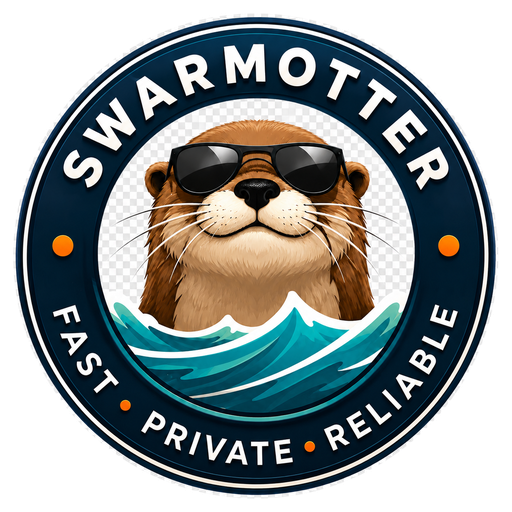

<p align="center">
  
</p>

<h1 align="center">SwarmOtter</h1>

<p align="center">
  <em>A fast little Rust BitTorrent daemon that keeps your swarm safely in its tunnel.</em>
</p>

<p align="center">
  SwarmOtter is a performance-first Rust BitTorrent daemon with a practical web
  UI, complete API, and fail-closed VPN/NIC traffic containment.
</p>

---

## Status

SwarmOtter's first release is `v1.0.0`. The live torrent data-plane engine
(real TCP and uTP peer wire protocol, HTTP/HTTPS/UDP trackers, DHT, PEX, BEP 9
metadata fetch, endgame, live bandwidth shaping, real disk I/O with fast
resume, inbound seeding/upload), fail-closed VPN/NIC network containment, the
complete REST API with WebSocket/SSE events, and the Web UI are implemented and
exercised end to end against local fixtures.

The project does **not** use an MVP release model. The first product release is
`v1.0.0`, and that release is complete only when all required features in
[`design/requirements.md`](design/requirements.md) are implemented, tested,
documented, and usable.

## What SwarmOtter Is

- A **Rust BitTorrent daemon** built for Linux/server and homelab deployments.
- **API-first** — the daemon and its API are the primary product surfaces.
- **Web UI included** — practical, function-over-form, consuming the same API
  exposed to external automation.
- **Performance-first** — efficient async networking, disk I/O, and bounded
  memory under many active torrents and peers.
- **Operationally correct** — predictable behavior, safe recovery, and clear
  diagnostics.
- **Containment-native** — VPN/NIC fail-closed traffic containment is a core
  requirement, not a deployment afterthought.

## What SwarmOtter Is Not

SwarmOtter is **not** a torrent indexer, search engine, piracy assistant, or
content-discovery tool.

It does not include bundled torrent indexes, infringing magnet links,
copyrighted media examples, or documentation encouraging copyright
infringement.

## Core Goals

- Performance-first Rust daemon
- Complete API
- Practical Web UI (function over form)
- Full magnet and `.torrent` support
- DHT, PEX, HTTP/HTTPS trackers, UDP trackers
- Watch-folder import
- Fast resume and forced recheck
- File selection and prioritization
- Queue, bandwidth, ratio, and seeding controls
- Strict VPN/NIC traffic containment
- Fail-closed behavior
- Container/homelab-friendly deployment
- Lawful-use project posture

## Network Containment

SwarmOtter treats network containment as a product requirement, not a
deployment afterthought.

All torrent-related traffic must be constrained through the configured network
path (VPN interface, source IP, network namespace, or explicitly configured
NIC), including:

- Peer TCP
- Peer UDP / uTP
- DHT UDP
- PEX-discovered peers
- UDP trackers
- HTTP / HTTPS trackers
- Webseeds
- Magnet metadata fetching
- DNS used by torrent operations

The daemon **fails closed** and never silently falls back to the default route
if the configured path is unavailable. The Web UI/API control plane is separate
from the torrent data plane.

See [`docs/network-containment.md`](docs/network-containment.md).

## Lawful Use

SwarmOtter is a general-purpose BitTorrent client intended for lawful
downloading, sharing, and seeding of content that users have the right to
access and distribute.

Examples include Linux distributions, open-source project releases,
public-domain media, open datasets, user-owned files, and
organization-approved distribution workflows.

Users are responsible for ensuring their use complies with applicable laws and
the rights of content owners. This is project policy and documentation, not
legal advice.

See:

- [`docs/lawful-use.md`](docs/lawful-use.md)
- [`docs/legal.md`](docs/legal.md)

## Developer Onboarding

### Prerequisites

- Rust stable (see `rust-version` in `Cargo.toml`)
- Cargo
- Git
- Linux is recommended for network-containment development and testing

### First-Time Setup

```bash
git clone https://github.com/sphildreth/swarmotter.git
cd swarmotter
cargo fmt
cargo check
cargo test
```

### Workspace Layout

SwarmOtter is a Cargo workspace with four crates:

| Crate | Role |
| --- | --- |
| `crates/swarmotterd` | Daemon binary |
| `crates/swarmotter-core` | Core types and live torrent engine logic |
| `crates/swarmotter-api` | API layer |
| `crates/swarmotter-web` | Web UI / static asset support |

## Repository Layout

```text
swarmotter/
├── AGENTS.md                  # Coding-agent governance rules
├── README.md
├── LICENSE                    # Apache-2.0
├── CONTRIBUTING.md
├── SECURITY.md
├── CODE_OF_CONDUCT.md
├── THIRD_PARTY_LICENSES.md
├── CHANGELOG.md
├── Cargo.toml                 # Workspace root
├── crates/
│   ├── swarmotterd/           # Daemon binary
│   ├── swarmotter-core/       # Core types and engine logic
│   ├── swarmotter-api/        # API layer
│   └── swarmotter-web/        # Embedded/static web support
├── docs/                      # User guide and operator documentation
├── design/                    # Requirements, architecture, policy, ADRs
│   ├── requirements.md
│   ├── architecture.md
│   ├── api.md
│   ├── configuration.md
│   ├── vpn-network-containment.md
│   ├── deployment.md
│   ├── testing.md
│   ├── lawful-use.md
│   ├── content-policy.md
│   ├── legal.md
│   └── adr/                   # Architecture decision records
├── assets/                    # Logo and brand graphics
└── .github/                   # Issue and PR templates
```

## ADRs and Decision Records

Important technical, legal, release, operational, and dependency decisions are
recorded as Architecture Decision Records (ADRs) in
[`design/adr/`](design/adr/).

New architecture, legal, release, dependency, or network-containment decisions
require ADRs. When in doubt, create one. See
[`design/adr/README.md`](design/adr/README.md) for the format and lifecycle.

Current decisions include the v1.0.0-only release model, the Rust/daemon
choice, API-first architecture, strict VPN/NIC containment, the function-over-
form UI philosophy, the Apache-2.0 license, and the lawful-use / no-piracy
posture.

## Simple Homelab Deployment

A typical homelab deployment will look like:

1. Run a VPN container or VPN-enabled network namespace.
2. Run `swarmotterd` inside that network path.
3. Mount persistent config and download directories.
4. Expose only the Web UI/API port to the LAN.
5. Keep torrent peer / tracker / DHT traffic constrained to the VPN path.

### Running the daemon

```bash
swarmotterd --config /etc/swarmotter/swarmotter.toml
```

### Example configuration

```toml
[api]
bind_address = "0.0.0.0:9091"

[storage]
download_dir = "/data/downloads"
incomplete_dir = "/data/incomplete"

[network]
mode = "strict"
required_interface = "tun0"
fail_closed = true
allow_ipv6 = false

[torrent]
listen_port = 51413
```

When strict traffic containment matters, homelab admins should prefer a
container / network namespace or VPN-routed deployment so the daemon cannot
reach peers, trackers, or DHT except through the configured path.

### Containers

A conceptual Podman/Docker-style layout:

```text
┌─────────────────────────┐      ┌──────────────────────────┐
│  VPN namespace / tun0    │◄────│  swarmotterd             │
│  (default route for the  │      │  - API/UI on 0.0.0.0:9091│
│   torrent data plane)    │      │  - peer/DHT on 51413     │
└─────────────────────────┘      └──────────────────────────┘
            │                                  │
            ▼                                  ▼
   torrent peers / trackers            LAN only (Web UI/API)
```

An example Dockerfile is provided in `deploy/Dockerfile`; see
[`docs/deployment.md`](docs/deployment.md) for container, VPN
network-namespace, and reverse-proxy setup.

See [`docs/deployment.md`](docs/deployment.md).

## Documentation

User-facing documentation:

- [User guide](docs/index.md)
- [Configuration](docs/configuration.md)
- [Network containment](docs/network-containment.md)
- [Deployment](docs/deployment.md)
- [Troubleshooting](docs/troubleshooting.md)
- [Lawful use](docs/lawful-use.md)
- [Legal and content policy](docs/legal.md)

Project design documentation:

- [Requirements](design/requirements.md)
- [Architecture](design/architecture.md)
- [API design](design/api.md)
- [Configuration design](design/configuration.md)
- [Network containment design](design/vpn-network-containment.md)
- [Testing design](design/testing.md)
- [ADRs](design/adr/README.md)

## Contributing

Contributions are welcome. To contribute:

- Read [`AGENTS.md`](AGENTS.md) for coding-agent and contributor governance.
- Read [`CONTRIBUTING.md`](CONTRIBUTING.md) for workflow and conventions.
- Create or update an ADR in [`design/adr/`](design/adr/) for decisions with
  lasting architectural, legal, release, dependency, or containment impact.
- Do **not** submit piracy-oriented features, indexers, infringing magnets, or
  copyrighted-content examples; see [`docs/legal.md`](docs/legal.md).
- Run `cargo fmt`, `cargo check`, and `cargo test` before considering work
  done.

## License

SwarmOtter is licensed under the Apache License, Version 2.0. See
[`LICENSE`](LICENSE). Dependency licenses are tracked in
[`THIRD_PARTY_LICENSES.md`](THIRD_PARTY_LICENSES.md).
