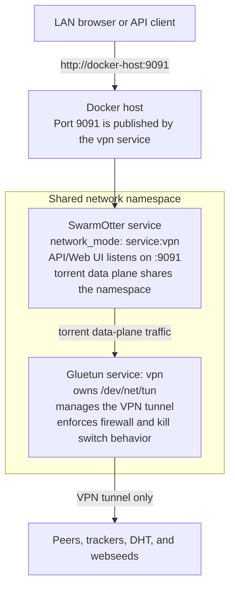

# Deployment

## Basic Linux service

Build the daemon:

```bash
cargo build --release
```

Install a config:

```bash
sudo install -d /etc/swarmotter /var/lib/swarmotter
sudo install -m 0644 config/swarmotter.toml.example /etc/swarmotter/swarmotter.toml
```

Edit `/etc/swarmotter/swarmotter.toml`, then run:

```bash
./target/release/swarmotterd --config /etc/swarmotter/swarmotter.toml
```

Logs are written to stderr and to the configured daemon log file. With default
logging, the per-user file is `~/.local/state/swarmotter/swarmotterd.log`
unless `XDG_STATE_HOME` is set.

## Release Artifacts

Version tags publish Linux-native artifacts on GitHub Releases:

- Linux `x86_64` and `aarch64` tarballs.
- `.deb` packages for `amd64` and `arm64`.
- `.rpm` packages for `x86_64` and `aarch64`.
- `SHA256SUMS` for the release assets.

The tarballs include `bin/swarmotterd`, configuration examples, deployment
examples, and the user-guide pages needed for local install review. The
packages install:

- `/usr/bin/swarmotterd`
- `/etc/swarmotter/swarmotter.toml`
- `/usr/lib/systemd/system/swarmotterd.service`
- `/var/lib/swarmotter`, `/data/downloads`, and `/data/incomplete`

Package installation creates the `swarmotter` service account and reloads
systemd metadata. It does not start the daemon automatically. Review
`/etc/swarmotter/swarmotter.toml`, make sure the configured containment path
exists, then enable the service:

```bash
sudo systemctl enable --now swarmotterd
```

## Systemd

An example unit is provided in:

```text
deploy/swarmotterd.service
```

Install it:

```bash
sudo install -m 0644 deploy/swarmotterd.service /etc/systemd/system/swarmotterd.service
sudo systemctl daemon-reload
sudo systemctl enable --now swarmotterd
```

Make sure the service user can read the config and write the storage
directories.

## Homelab Docker Compose with Gluetun

The production container image is published to:

```text
ghcr.io/sphildreth/swarmotter
```

The repository workflow builds pull requests without publishing and publishes a
multi-architecture image on successful pushes to `main`. Main builds are tagged
as `main` and `sha-<shortsha>`. Version-tag releases publish `linux/amd64` and
`linux/arm64` images tagged as `vX.Y.Z`, `X.Y.Z`, `X.Y`, `X`, and `latest`.
After the first GHCR publish, set the package visibility to public in GitHub
Packages if anonymous homelab pulls are desired.

### What is Gluetun?

[Gluetun](https://github.com/qdm12/gluetun) is a containerized VPN client,
firewall, and network namespace boundary. The official image is
`qmcgaw/gluetun`. It supports common VPN providers and custom VPN
configuration, including OpenVPN and WireGuard.

SwarmOtter uses Gluetun in the provided Compose stack because it gives the
homelab deployment a clear torrent data-plane boundary:

- VPN credentials live in `deploy/gluetun.env`, separate from the SwarmOtter
  API token.
- The Gluetun container owns the tunnel device and firewall rules.
- The SwarmOtter container joins Gluetun's network namespace with
  `network_mode: "service:vpn"`.
- The API/Web UI port is published by the `vpn` service, while torrent peer,
  tracker, DHT, webseed, and torrent DNS traffic share Gluetun's contained
  network path.

In this layout, Gluetun is the fail-closed boundary. If the VPN namespace or
firewall is unhealthy, SwarmOtter's torrent data plane cannot use the normal
Docker bridge as a fallback. This follows Gluetun's documented pattern for
[connecting another container to Gluetun's network
stack](https://github.com/qdm12/gluetun-wiki/blob/main/setup/connect-a-container-to-gluetun.md).

The provided Compose stack runs SwarmOtter in the Gluetun network namespace:

```text
deploy/compose.yml
```

The SwarmOtter container config used by this stack disables in-app network
containment because all SwarmOtter traffic shares Gluetun's VPN namespace and
firewall.

The traffic layout looks like this:



See [Network Containment](network-containment.md) for the general
fail-closed model and the difference between control-plane and data-plane
traffic.

Prepare host directories:

```bash
sudo install -d -m 0755 /srv/swarmotter/config
sudo install -d -o 10001 -g 10001 /srv/swarmotter/state
sudo install -d -o 10001 -g 10001 /srv/swarmotter/downloads
sudo install -d -o 10001 -g 10001 /srv/swarmotter/incomplete
sudo install -d /srv/swarmotter/gluetun
sudo install -m 0644 config/swarmotter.container.toml.example /srv/swarmotter/config/swarmotter.toml
```

Create and edit the Compose environment file:

```bash
cd deploy
cp .env.example .env
cp gluetun.env.example gluetun.env
openssl rand -hex 32
```

Set `SWARMOTTER_API_TOKEN` in `.env` to the generated token. Fill in
`gluetun.env` with the settings required by your VPN provider. For custom
WireGuard providers, this usually includes `WIREGUARD_PRIVATE_KEY`,
`WIREGUARD_ADDRESSES`, `WIREGUARD_PUBLIC_KEY`, `WIREGUARD_ENDPOINT_IP`, and
`WIREGUARD_ENDPOINT_PORT`. The split keeps the SwarmOtter API token out of the
Gluetun container environment.

Validate and start the stack:

```bash
docker compose --env-file .env -f compose.yml config
docker compose --env-file .env -f compose.yml pull
docker compose --env-file .env -f compose.yml up -d
```

Verify the API and image:

```bash
curl -fsS http://localhost:9091/health
docker buildx imagetools inspect ghcr.io/sphildreth/swarmotter:latest
docker compose --env-file .env -f compose.yml exec swarmotter curl -fsS https://ifconfig.me
```

Update explicitly when a new stable release image is published:

```bash
cd deploy
docker compose --env-file .env -f compose.yml pull swarmotter
docker compose --env-file .env -f compose.yml up -d swarmotter
```

The repository also includes an update helper for Compose-based Docker servers:

```bash
cd deploy
./update-swarmotter.sh
```

The helper is intended to run as a normal user with Docker access and sudo
rights. Root-owned `0600` `.env` and `gluetun.env` files are supported; the
helper uses sudo only where needed to read or update deployment secrets and
state. With no image argument, it resolves the latest GitHub Release and uses
the matching `ghcr.io/sphildreth/swarmotter:vX.Y.Z` image. If the running
container already has that version label, the helper exits without backing up,
pulling, or restarting. Otherwise, it backs up Compose environment files,
SwarmOtter configuration, SwarmOtter state, and Gluetun state into
`~/swarmotter-backups`, updates `SWARMOTTER_IMAGE`, recreates the Compose stack
so Docker attaches networks before Gluetun installs VPN routes, validates the
health endpoint, image labels, and contained egress from the SwarmOtter
container, and keeps a local rollback image tag.

Pass an explicit image or tag only when pinning a specific release or
performing a rollback:

```bash
./update-swarmotter.sh ghcr.io/sphildreth/swarmotter:v1.0.0
```

Use `--force` to back up, pull, recreate, and validate even when the installed
version already matches the latest release:

```bash
./update-swarmotter.sh --force
```

For a pinned rollback, set `SWARMOTTER_IMAGE` in `deploy/.env` to a `vX.Y.Z` or
`sha-<shortsha>` tag and run the update commands again.

## LAN Web UI with contained torrents

This exposes the control plane to the LAN while binding torrent data-plane
sockets to `br0`:

```toml
[api]
bind_address = "0.0.0.0:9091"
require_auth = true
auth_token = "replace-with-a-long-random-token"

[storage]
download_dir = "/mnt/incoming/swarmotter/downloads"
incomplete_dir = "/mnt/incoming/swarmotter/incomplete"

[network]
mode = "strict"
required_interface = "br0"
allow_ipv6 = true
fail_closed = true
validate_route = true
validate_dns = true

[torrent]
listen_port = 51413
allow_ipv6 = true
utp_enabled = true
utp_prefer_tcp = true
encryption_mode = "preferred"
```

The service user needs write access to both storage directories. Incomplete
torrents write to `incomplete_dir`; verified completed data is moved into
`download_dir`.

## Container or VPN namespace

For stronger isolation, run SwarmOtter inside a network namespace or container
whose only torrent data-plane path is the intended VPN or NIC path.

Container sketch:

```bash
docker build -f deploy/Dockerfile -t swarmotter .
docker run -d --name swarmotter \
  -p 9091:9091 \
  -e SWARMOTTER_API__AUTH_TOKEN="$(openssl rand -hex 32)" \
  -v /data/downloads:/data/downloads \
  -v /data/incomplete:/data/incomplete \
  -v /var/lib/swarmotter:/var/lib/swarmotter \
  -v /etc/swarmotter:/etc/swarmotter:ro \
  swarmotter
```

Attach the container to the intended contained network instead of the default
bridge when strict data-plane containment is required.

## Reverse proxy

A reverse proxy may sit in front of the API/Web UI. Keep authentication enabled
unless another trusted auth layer protects access.

```nginx
server {
    listen 80;
    server_name swarmotter.example;

    location / {
        proxy_pass http://127.0.0.1:9091;
        proxy_set_header Host $host;
        proxy_set_header X-Real-IP $remote_addr;
    }

    location /api/v1/ws {
        proxy_pass http://127.0.0.1:9091;
        proxy_http_version 1.1;
        proxy_set_header Upgrade $http_upgrade;
        proxy_set_header Connection "upgrade";
    }

    location /api/v1/events {
        proxy_pass http://127.0.0.1:9091;
        proxy_buffering off;
        proxy_read_timeout 1h;
    }
}
```
