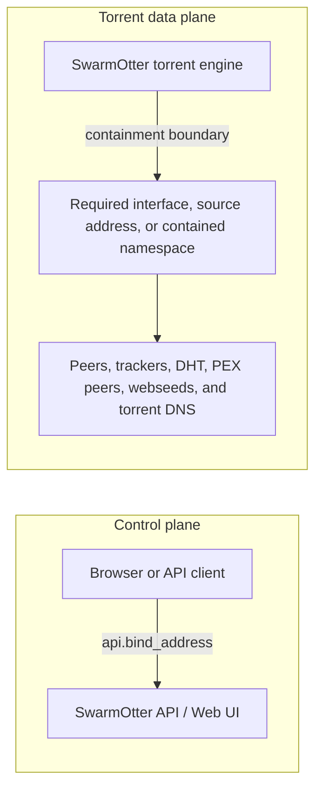
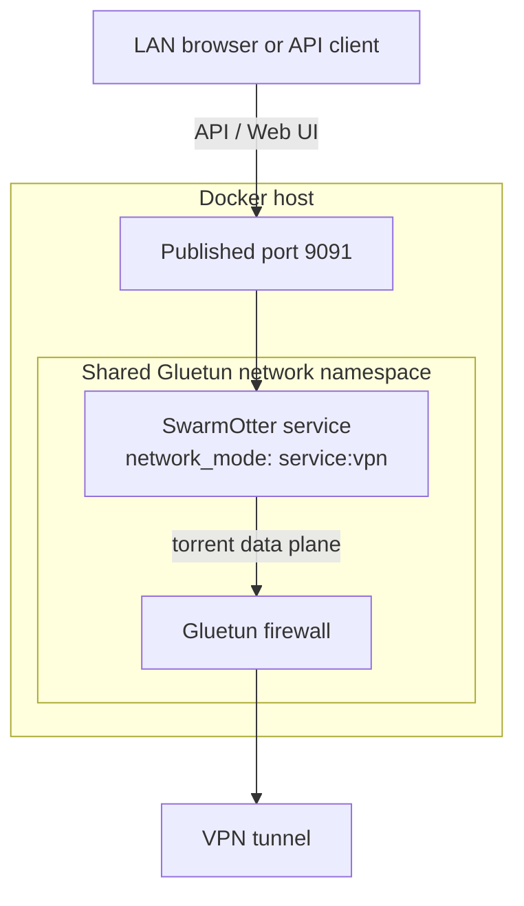
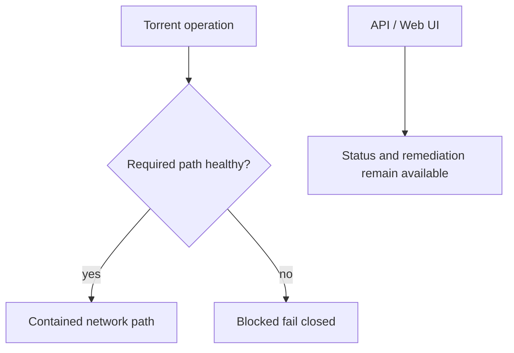

# Network Containment

Network containment is SwarmOtter's fail-closed data-plane routing model.

It applies to torrent-related traffic:

- Peer TCP.
- Peer UDP and uTP.
- DHT UDP.
- PEX-discovered peers.
- UDP tracker announces.
- HTTP and HTTPS tracker announces.
- Webseeds.
- Magnet metadata fetching.
- DNS used by torrent operations.

The API and Web UI are separate control-plane traffic and use
`api.bind_address`.

## Traffic planes

SwarmOtter separates API/Web UI control traffic from torrent data-plane
traffic. Network containment applies to the torrent data plane.



For the Docker Compose deployment, the containment boundary is Gluetun:



## Fail-closed behavior

When strict containment is enabled and the configured path is unavailable,
SwarmOtter blocks torrent networking instead of falling back to the default
route.



Common fail-closed conditions:

- The required interface does not exist.
- The required interface is down.
- The required interface has no usable IP address.
- A configured source address is no longer assigned.
- IPv6 is required but disabled in network or torrent configuration.
- The route cannot be validated when route validation is enabled.
- DNS cannot be validated when DNS validation is enabled.
- The required network namespace is unavailable.
- Socket binding fails.

The API reports the current state at:

```text
GET /api/v1/network/health
```

The Web UI displays the same health state.

## Dynamic interface binding

For DHCP or SLAAC addresses, bind to an interface instead of an address:

```toml
[network]
mode = "strict"
required_interface = "br0"
allow_ipv6 = true
fail_closed = true
validate_route = true
validate_dns = true

[torrent]
allow_ipv6 = true
```

On Linux, SwarmOtter enforces sockets with device-bound sockets. IPv4 and IPv6
connections are both allowed when the interface has usable addresses and both
`network.allow_ipv6` and `torrent.allow_ipv6` are true. Hostname resolution is
allowed only when DNS is also proven constrained to the configured path, such
as systemd-resolved link DNS reported by `resolvectl dns br0`.

## DNS policy

DNS is part of torrent traffic. In strict containment, hostname resolution must
not escape through an unconstrained resolver.

Use one of these patterns:

- Bind to an interface whose DNS is visible to the Linux probe, such as
  systemd-resolved link DNS from `resolvectl dns br0`.
- Use a contained network namespace or container network where DNS is part of
  the contained path.
- Use IP-literal peers, trackers, and bootstrap nodes when DNS containment is
  not available.
- Set `validate_dns = true` when you want network health to report
  `dns_not_constrained` proactively instead of discovering it at tracker/DHT
  resolution time.

## Health states

| State | Meaning |
| --- | --- |
| `healthy` | Torrent networking can use the configured contained path. |
| `disabled` | Network containment is disabled. |
| `interface_missing` | The configured interface name is not visible to the daemon. |
| `interface_down` | The configured interface exists but is down. |
| `no_interface_address` | The interface has no usable IPv4 or allowed IPv6 address. |
| `source_address_missing` | A configured source address is not assigned. |
| `route_invalid` | Route validation failed. |
| `socket_bind_failed` | The daemon could not bind a socket to the configured path. |
| `dns_not_constrained` | DNS validation was requested but could not be proven safe. |
| `network_namespace_unavailable` | The daemon is not in the required namespace. |
| `blocked_fail_closed` | Strict containment blocked traffic. |
